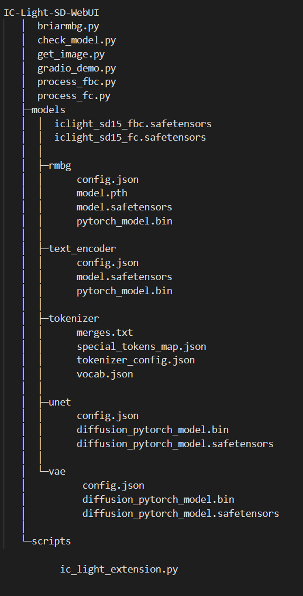

# IC-Light-SD-WebUI

 [IC-Light](https://github.com/lllyasviel/IC-Light) is a project to manipulate the illumination of images.

We know that SD can generate beautiful character and landscape images, so there is this extension integrated into SD-WebUI.

## Download models

To use it in SD-WebUI,you need download many contents.

download them from following links:

main models: 
https://huggingface.co/lllyasviel/ic-light/tree/main

rmbg:  
 https://huggingface.co/briaai/RMBG-1.4/tree/main

vae,unet,tokenizer,text_encoder: 
https://huggingface.co/stablediffusionapi/realistic-vision-v51

国内用户从镜像站下载：

main models: 
https://hf-mirror.com/lllyasviel/ic-light

rmbg: 
https://hf-mirror.com/briaai/RMBG-1.4

vae,unet,tokenizer,text_encoder: 
https://hf-mirror.com/stablediffusionapi/realistic-vision-v51

Make sure the folder structure like this:

## How to use

IC-Light has two workflows. The FC workflow directly extracts characters from the image and generates a new photo based on prompt words.

First, we use SD to generate a good-looking picture. Then, we open the IC-Light tab, load the model and the just-generated image in order, add a few prompt words, and then we can get a picture that feels different from before.

Unlike the FC workflow, the FBC workflow allows us to import a specified background image and does not modify it.

## Notice

* You must click "Use FC"/"Use FBC" first
* "download from hf-mirror"  can't download iclight_sd15_fc.safetensors and iclight_sd15_fbc.safetensors,you should download it from huggingface

## common mistakes

* If you use the workflow, you must load a model,else it will cause an error : TypeError: 'NoneType' object is not callable
  

## 国内用户，可以直接从百度网盘下载整合包

链接： https://pan.baidu.com/s/1kb3rBi3MIG2Dl5b-DSiCyg?pwd=1111 

将整合包解压放在extensions目录下

